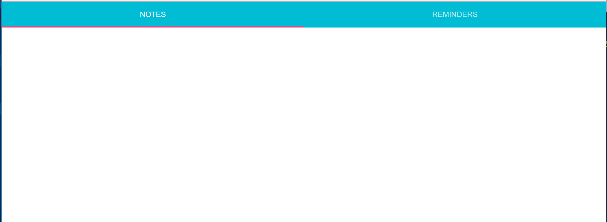

# Data Driven UX - Part 1

## Getting Started

This post is the beginning of a series about creating Data Driven UX.  Over the course of the series, we will iterate over a basic example application until we have a generic React component that we can use in any project to easily configure Data Driven UX.  The source code for this post is found in [a Github repository](https://github.com/chris-wall/data-driven-ux-part-1)

The posts in this series are:

- [Getting to Know React](https://github.com/chris-wall/data-driven-ux-part-1)
- [Play Pretend](https://github.com/chris-wall/data-driven-ux-part-2)
- HATEOAS for a Configurable UI
- HATEOAS as Security Mechanism
- Make Reusable Parts

## What does this mean?

There’s no denying that the User Interface of the average web application is becoming more and more complicated by the day.  Expanding complexity also expands the potential for defects and security flaws to make their way into your code.  It’s been said by much smarter people than I that “the best code is no code” and I wholeheartedly agree.
But how do we tackle the ballooning size and complexity of today’s User Experience with less code?

With more data!  Using data to drive the UX cuts down on Lines of Code (LOC), redundancy, and all those other things people keep telling you are bad for your application.  This also gives us the ability to keep security where it belongs – on the server – while still driving the application interface construction from the client side.

For the purposes of this series, we will define a Data Driven UX as a way to drive the functionality of the UI from data returned from the server.  This allows us many benefits over a statically coded UI as it cuts down on the Lines of Code necessary to achieve the same result, helps make security implementation easier and potentially more granular, and allows for an easier implementation of multi-tenancy with customizations.

Like any other methodology, Data Driven UX is not a silver bullet and it is an exercise for the application designers on whether this is the best fit for their application.  Using this method adds complexity to the code in your UI and you must weigh the value of what it provides with your understanding of your team's talents and ability to maintain a more complex codebase.  

In this post we will lay the groundwork that we will expand upon in the rest of the series.  If you are already well versed with React, feel free to skip ahead to another post in the series.  Each post builds on the one before it, but you can clone this repository before proceeding if you prefer to follow along in code.

## React to the UI

Let’s take a look at a basic React application.  If you are not familiar with React, it is worth looking into but for the purpose of this lesson you can just assume it’s pseudocode as even with little to no context React is clean and easy to follow.  The one point you need to know to understand what’s going on is that React is only a View layer and that view is generated in JavaScript as opposed to text templates like handlebars or in bound HTML files like Angular.

First, we need to install a couple prerequisites to make this go more easily - Yarn and Create React App.  If you don't already have these installedType each of these lines into your command prompt:

`npm i -g yarn`

`npm i -g create-react-app`

To create the application shell, we can lean on the wonderful Create React App CLI tool.  Navigate to a folder you want to use for your tutorials (e.g. `%USERPROFILE%\data-drive-ux`) and enter `create-react-app data-driven-ux-part-1` and wait for it to finish setting up your application.

An important next step is to disable the Service Worker registration that occurs by default in an application generated by this tool.  Open `index.js` and comment out the line:

```js
registerServiceWorker();
```

We will examine this line and how to better make use of it in a future post, but for now just comment it out so we don't have to battle the cache when trying to see our changes in the browser.

You should now be able to enter `yarn start` at the command prompt to see your React application come to life!

## The App

With the skeleton laid out and ready, it's time to start adding meat to those bones.  Let's start building up a basic React application around this base.  

### Dependencies

To make the application useful, we will need to add a few packages.  Run this command in your command prompt to install the dependencies: `yarn add redux react-redux material-ui`

I'll go over each of these dependencies in a little more detail for you.

#### Redux / React-redux

Redux is a popular state management library for JavaScript applications.  It is derivative of the Flux pattern introduced by Facebook but with enough difference to set it apart as its own paradigm.  React-redux is a library of quality of life functions to integrating Redux with React.

#### Material UI

Material UI is a set of ready to use UI components based on Google's Material Design philosophy.  This will get our application up and running quickly without the visual scarring our eyeballs.

### Laying It Out

The first file we need to start playing around with is the `App.js` file.  Open this one up and remove all the contents and replace with the following:

```js
import React from 'react';
import { createStore } from 'redux';
import { Provider } from 'react-redux';
import MuiThemeProvider from 'material-ui/styles/MuiThemeProvider';
import {Tabs, Tab} from 'material-ui/Tabs';

const store = createStore((state, action) => state, { todos: [], notes: [] });

const App = () => (
  <MuiThemeProvider>
    <Provider store={store}>
      <Tabs>
        <Tab label="Notes">
        </Tab>
        <Tab label="ToDos">
        </Tab>
      </Tabs>
    </Provider>
  </MuiThemeProvider>
);

export default App;
```

If you go back to your web browser (assuming you haven't closed it), you should see something like the screenshot below.  Three cheers for hot reloading!



Let's look at this file in a little more detail now so we can explain what's going on here.  Fisrt we are importing a number of components and functions from various libraries.

- `import React from 'react'`: anywhere that we use JSX (the HTML-like syntax of the component), we need to include this import.
- `import { createStore } from 'redux'`: createStore is a function we use to initialize our Redux state store.
- `import { Provider } from 'react-redux'`: Provider is a component that allows us to specify a store that will cascade in a safe way to all the child components in the tree.
- `import MuiThemeProvider from 'material-ui/styles/MuiThemeProvider'`: MuiThemeProvider is part of the Material UI library and sets a theme for the child components to use.
- `import { Tabs, Tab } from 'material-ui/Tabs'`: Tabs and Tab are components from the Material UI library that we will use to compose our UI.

Next we use this line to initialize the Redux state store:

`const store = createStore((state, action) => state, { todos: [], notes: [] });`

We are calling the aforementioned `createStore` function and providing it a simple function that returns state and an object to use as the store's initial state.  A deep dive of Redux is outside of the scope of this post but as we make changes to this later I will try to explain them in adequate detail.  For now, however, this simple line will suffice.

The next block of code is where we define the actual App component that we want to use.

```js
const App = () => (
  <MuiThemeProvider>
    <Provider store={store}>
      <Tabs>
        <Tab label="Notes">
        </Tab>
        <Tab label="ToDos">
        </Tab>
      </Tabs>
    </Provider>
  </MuiThemeProvider>
);
```

Here we are composing the App component from the many child components we have imported previously.  

By the way, since we removed the original content from the App.js file, you can also delete the `logo.svg` and `App.css` files from the project.  You can also delete the `App.test.js` file as we aren't writing any tests as part of this post.  I left it in because testing is good practice and if this were a real application we would most certainly want to write tests!

### Becoming Content

Now that we have a layout, we need to add some content components.  We need one to display the Notes and one to display the ToDos.  Add two files to your project named `Notes.js` and `ToDos.js`.  The content of the two files should look something like this:

#### Notes.js

```js
import React from 'react';
import { List, ListItem } from 'material-ui/List';
import Paper from 'material-ui/Paper';

const style = {
  minHeight: 100,
  width: '85%',
  margin: 20,
  textAlign: 'left',
  display: 'block',
};

const Notes = ({ notes }) => (
  <Paper style={style} zDepth={2}>
    <List>
      { 
        (Array.isArray(notes) && notes.length > 0) ?
          notes.map(n => <ListItem primaryText={n} />) :
          <ListItem primaryText="No Notes found" />
      }
    </List>
  </Paper>
);

export default Notes;
```

#### ToDos.js

```js
import React from 'react';
import { List, ListItem } from 'material-ui/List';
import Paper from 'material-ui/Paper';

const style = {
  minHeight: 100,
  width: '85%',
  margin: 20,
  textAlign: 'left',
  display: 'block',
};

const ToDos = ({ todos }) => (
  <Paper style={style} zDepth={2}>
    <List>
      { 
        (Array.isArray(todos) && todos.length > 0) ?
          notes.map((n, i) => <ListItem primaryText={n} key={`note_${i}`} />) :
          <ListItem primaryText="No ToDos found" />
      }
    </List>
  </Paper>
);

export default ToDos;
```

Don't worry that these two files look almost identical; we'll get to the refactoring later, promise!  But first let's talk about what's going on in these files.  These are generating React components that we will use to actually display our content.  One of the first things that should stick out, is the delcaration of an object literal we assign to a `style` constant.

```js
const style = {
  minHeight: 100,
  width: '85%',
  margin: 20,
  textAlign: 'left',
  display: 'block',
};
```

React gives us the ability to define our styles in JavaScript instead of CSS.  There are limitations and some places where you may still have to lean on CSS, but this is a good way to keep things grouped together.  For the record, I prefer to keep these in separate files where I can centralize and share them between components, but this is a simple example.

```js
const ToDos = ({ todos, ...rest }) => (
  <Paper style={style} zDepth={2}>
    <List>
      { 
        (Array.isArray(todos) && todos.length > 0) ?
          todos.map((t, i) => <ListItem primaryText={t} key={`todo_${i}`} />) :
          <ListItem primaryText="No ToDos found" />
      }
    </List>
  </Paper>
);
```

The real work is happening here.  We are delcaring a constant - `ToDos` - that will hold a function.  This is the simplest way to declare a React component.  React will provide the component's properties as an argument to the function when the component is created.  Here we are destructuring the props argument to get our ToDo records and then stuffing any other props into an array named `rest`.  The rest of the code is JSX as you've seen before, but this time we include some JS code to generate React components from the items in the todos array.

With that out of the way, we need to make some changes to `App.js` so we can actually use these shiny new components.  Let's import them and then add them to their respective tab pages like so:

#### App.js

```js
import Notes from './Notes';
import ToDos from './ToDos';
```

```js
<Tabs>
  <Tab label="Notes">
    <div style={style}>
      <Notes notes={[]} />
    </div>
  </Tab>
  <Tab label="ToDos">
    <div style={style}>
      <ToDos todos={[]} />
    </div>
  </Tab>
</Tabs>
```

Save those changes and watch as your page updates with the new content.  But, wait, how do we actually get the data into these components?

### Using Redux

So now that we have a decent shell and content components, we need to figure out how to get data into those components.  We could pass it down the props chain as you can see we are just passing an empty array now but that gets unmanageable really quickly once you get many levels of nested components.  React-Redux to the rescue!

#### Notes.js

Add the following lines to the `Notes.js` file:

```js
import { connect } from 'react-redux';
```

```js
const mapStateToProps = (state) => ({
  notes: state.notes || []
});
```

Replace the current export expression with the following line:

```js
export default connect(mapStateToProps)(Notes);
```

#### ToDos.js

Add the following lines to the `ToDos.js` file:

```js
import { connect } from 'react-redux';
```

```js
const mapStateToProps = (state) => ({
  todos: state.todos || []
});
```

Replace the current export expression with the following line:

```js
export default connect(mapStateToProps)(ToDos);
```

Remember that the `Provider` component in `App.js` is going to pass the store down to all child components.  The `connect` function supplied by react-redux gives us the facility to automatically pull data from this store and pass it to the wrapped component via props.

`connect` will take the state from the provided Redux store and pass it to the function stored in our `mapStateToProps`.  This will generate a new object that will be added to the existing props.  In the example above, the `notes` prop is added and its value set to the notes property of the supplied state object.  If it happens to be null or undefined, we will set it to an empty array.

The `export` expression is where we tie it all together.  `connect` is a function that takes the `mapStateToProps` function as an argument.  It then returns - wait for it - another function to which you supply the component to be wrapped.  The result of that function call is the Higher Order Component that will actually be used whenever someone `import`s the default of this module.

Well, that's all well and good but it still doesn't have any actual data.  True, but the mechanism is there to inject the data when we do have some into these components with no extra work on our part!

The easiest way to get some data quickly is just to add mock data to the initial state when we create the store.  In `App.js` change the `createStore` call as follows:

#### App.js

```js
const initialState = {
  todos: [
    "Go to the grocery store",
    "Sweep the garage",
    "Mail out those thank you notes"
  ],
  notes: [
    "I saw a blue footed boobiebird today!",
    "Remember to get milk next time you're at the grocery store"
  ]
};
const store = createStore((state, action) => state, initialState);
```

Also change the lines where we manually added empty arrays as props:

```js
<Notes />
...
<ToDos />
```

We'll add actual API calls for data in the next installment.  For now we will just work with this mock data to get us going.

## Action!

What good is an application if it can't actually act against the data store?  These records should be able to be created or deleted at the very least.  In order to do this we first need what Redux calls Action Creators and Reducers.  An "Action" in the vocabulary of Redux is an object with at least one property named "type" that is a string.  

We're going to add a new file named `Store.js` with the following content:

```js

const Types = {
  CREATE_NOTE: 'create-note',
  CREATE_TODO: 'create-todo',
  DELETE_NOTE: 'delete-note',
  DELETE_TODO: 'delete-todo'
};

export function reducer(state = {}, action) {
  const { notes, todos } = state;

  switch (action.type) {
    case Types.CREATE_NOTE:
      notes.push(action.note);
      break;
    case Types.CREATE_TODO:
      todos.push(action.todo);
      break;
    case Types.DELETE_NOTE:
      notes.splice(action.index, 1);
      break;
    case Types.DELETE_TODO:
      todos.splice(action.index, 1);
      break;
    default:
      return state;
  }

  return Object.assign({}, state, { notes, todos });
};

export function createNote(note) {
  return { type: Types.CREATE_NOTE, note };
};

export function createTodo(todo) {
  return { type: Types.CREATE_TODO, todo };
};

export function deleteNote(index) {
  return { type: Types.DELETE_NOTE, index };
};

export function deleteTodo(index) {
  return { type: Types.DELETE_TODO, index };
};
```
These concepts are new to this post so let's walk through them in detail.  This file is basically the heart of our Redux implementation.

```js
export function reducer(state = {}, action) {
  const { notes, todos } = state;

  switch (action.type) {
    case Types.CREATE_NOTE:
      notes.push(action.note);
      break;
    case Types.CREATE_TODO:
      todos.push(action.todo);
      break;
    case Types.DELETE_NOTE:
      notes.splice(action.index, 1);
      break;
    case Types.DELETE_TODO:
      todos.splice(action.index, 1);
      break;
    default:
      return state;
  }

  return Object.assign({}, state, { notes, todos });
};
```

This function is commonly called the "reducer".  This will be called by Redux in response to an action being dispatched.  You can envision the reducer as a state event subscriber. 

One thing that may or may not be apparent is that the reducer has to return a full and valid state object each time it runs.  Modifying the existing state object will not work.  This forces the code to treat the application state as immutable and affect a wholesale replacement of the state on each action.

```js
export function createNote(note) {
  return { type: Types.CREATE_NOTE, note };
};

export function createTodo(todo) {
  return { type: Types.CREATE_TODO, todo };
};

export function deleteNote(index) {
  return { type: Types.DELETE_NOTE, index };
};

export function deleteTodo(index) {
  return { type: Types.DELETE_TODO, index };
};
```

These functions are known as Action Creators.  The name is pretty self explanatory as they only exist to create new instances of an Action.  These are optional, as it's not very difficult to create the same object literal yourself, it just centralizes the creation of action instances and helps to serve as code-based documentation for the actions available in your application.  It's a trade-off between centralization and boilerplate.

### Dispatcher

We have action creators and a reducer to handle the actions, but how do we wire it all up to create a functioning application?

First, lets go back to `createStore` in our `App.js` file.

#### App.js

```js
import { reducer } from './Store';
...
const store = createStore(reducer, initialState);
```

As you can see, we've updated the call to `createStore` to include our new `reducer` function instead of the inline function we were using previously.  Now we just need a way to dispatch these actions so that our reducer can handle them.  For that we will go back to the Notes and ToDos components and leverage another feature of `connect`.

#### Notes.js

Add some new imports, most of which are just to add some features to the UI:

```js
import ActionDelete from 'material-ui/svg-icons/action/delete';
import { red500 } from 'material-ui/styles/colors';
import RaisedButton from 'material-ui/RaisedButton';
import IconButton from 'material-ui/IconButton';
import Divider from 'material-ui/Divider';
import { createNote, deleteNote } from './Store';
```

Now below our `mapStateToProps` declaration, we will add another similar construct - mapDispatchToProps.  The Redux store exposes a `dispatch` function that we use to publish actions.  To avoid directly passing in dispatch and using it directly, we use the `mapDispatchToProps` in much the same way we used the `mapStateToProps` earlier to generate new properties entires that can map back to dispatch calls.

Below we are wrapping the dispatch of our create note and delete note actions:

```js
const mapDispatchToProps = (dispatch) => ({
  createNote: (note) => { 
    dispatch(createNote(note));
  },
  deleteNote: (index) => {
    dispatch(deleteNote(index));
  }
});
```

Next add some UI elements that allow us to call these functions.  We will add a button at the top of the tab page for creating a new note and add a trash icon on each existing note in the list to allow for deleting that note.

```js
const Notes = ({ notes, createNote, deleteNote, ...rest }) => (
  <Paper style={style} zDepth={2}>
    <RaisedButton label="Create a New Note" style={{ width: 500, margin: 20 }} primary={true} onClick={() => createNote('a new note!')} />
    <Divider inset={true} />
    <List>
      { 
        (Array.isArray(notes) && notes.length > 0) ?
          notes.map((n, i) => <ListItem primaryText={n} key={`note_${i}`} rightIconButton={
            <IconButton touch={true} onClick={() => deleteNote(i)}>
              <ActionDelete color={red500} />
            </IconButton>
          } />) :
          <ListItem primaryText="No Notes found" />
      }
    </List>
  </Paper>
);
```

And finally, change the export so that `connect` can make use of our new mapDispatchToProps construct:

```js
export default connect(mapStateToProps, mapDispatchToProps)(Notes);
```

#### ToDos.js

We also need to make similar changes to `ToDos.js` which when completed will leave the file looking like this:

```js
import React from 'react';
import { connect } from 'react-redux';
import { List, ListItem } from 'material-ui/List';
import Paper from 'material-ui/Paper';
import ActionDelete from 'material-ui/svg-icons/action/delete';
import { red500 } from 'material-ui/styles/colors';
import RaisedButton from 'material-ui/RaisedButton';
import IconButton from 'material-ui/IconButton';
import Divider from 'material-ui/Divider';
import { createToDo, deleteToDo } from './Store';

const style = {
  minHeight: 100,
  width: '85%',
  margin: 20,
  textAlign: 'left',
  display: 'block',
};

const mapStateToProps = (state) => ({
  todos: state.todos || []
});

const mapDispatchToProps = (dispatch) => ({
  createToDo: (todo) => { 
    dispatch(createToDo(todo));
  },
  deleteToDo: (index) => {
    dispatch(deleteToDo(index));
  }
});

const ToDos = ({ todos, createToDo, deleteToDo, ...rest }) => (
  <Paper style={style} zDepth={2}>
    <RaisedButton label="Create a New ToDo" style={{ width: 500, margin: 20 }} primary={true} onClick={() => createToDo('a new todo!')} />
    <Divider inset={true} />
    <List>
      { 
        (Array.isArray(todos) && todos.length > 0) ?
        todos.map((t, i) => <ListItem primaryText={t} key={`todo_${i}`} rightIconButton={
            <IconButton touch={true} onClick={() => deleteToDo(i)}>
              <ActionDelete color={red500} />
            </IconButton>
          } />) :
        <ListItem primaryText="No ToDos found" />
      }
    </List>
  </Paper>
);

export default connect(mapStateToProps, mapDispatchToProps)(ToDos);
```
### Immutable Records

Wait a minute!  Shouldn't we be able to edit or at least specify the text of a new Note or ToDo?  Good point, fair reader.  Let's look at doing just that.  For starters, let's update our `Store.js` file to include action creators and reducer logic for these new actions.  Our `Store.js` file should now look like this:

#### Store.js

We added some Type constants for the modify actions and then added two new action creators for them as well.

```js
const Types = {
  CREATE_NOTE: 'create-note',
  CREATE_TODO: 'create-todo',
  DELETE_NOTE: 'delete-note',
  DELETE_TODO: 'delete-todo',
  MODIFY_NOTE: 'modify-note',
  MODIFY_TODO: 'modify-todo'
};

export function modifyNote(index, note) {
  return { type: Types.MODIFY_NOTE, index, note };
};

export function modifyToDo(index, todo) {
  return { type: Types.MODIFY_TODO, index, todo };
};
```
Now we need to update the reducer logic to add these two new case statements and clean things up a little bit in this function:

```js
export function reducer(state = {}, action) {
  
  const notes = Array.from(state.notes);
  const todos = Array.from(state.todos);
  
  switch (action.type) {
    case Types.CREATE_NOTE:
      notes.push(action.note);
      break;
    case Types.CREATE_TODO:
      todos.push(action.todo);
      break;
    case Types.DELETE_NOTE:
      notes.splice(action.index, 1);
      break;
    case Types.DELETE_TODO:
      todos.splice(action.index, 1);
      break;
    case Types.MODIFY_NOTE:
      notes.splice(action.index, 1, action.note);
      break;
    case Types.MODIFY_TODO:
      todos.splice(action.index, 1, action.todo);
      break;
    default:
      return state;
  }

  return Object.assign({}, state, { notes, todos });
};
```

One of my biggest gripes with React is the handling of form fields.  It feels like reinventing the wheel to me and adds boilerplate to my code that I don't feel like I need.  But it's the world we live in and overall I really love React so I'll deal with it.  To keep going, we'll have to face this issue head on.  Create a new file in your project named `TextInput.js` and add the following content:

#### TextInput.js

```js
import React from 'react';
import TextField from 'material-ui/TextField';

export default class TextInput extends React.Component {

  constructor(props) {
    super(props);

    this.state = {
      value: props.value || ''
    };
  }

  componentWillReceiveProps(nextProps) {
    if (nextProps.value !== this.props.value) {
      this.setState({
        value: nextProps.value,
      });
    }
  }

  handleChange = (event) => {
    this.setState({
      value: event.target.value,
    });
  };

  render() {
    const { id, value, ...rest } = this.props;
    return (
      <TextField
        id={`txt-${id}`}
        value={this.state.value}
        onChange={this.handleChange}
        {...rest}
      />
    );
  }
}
```

Since this is a new concept for this post, we should take a look at what's happening in this file.  For one, we are creating this component by extending the base component from React rather than using a simple arrow function.  This is because we need the lifecycle hooks and access to the new component's internal state.

```js
constructor(props) {
  super(props);

  this.state = {
    value: props.value || ''
  };
}
```

In the constructor, we just initialize the `state` of the component to an object literal using the `value` passed in via the props.

```js
componentWillReceiveProps(nextProps) {
  if (nextProps.value !== this.props.value) {
    this.setState({
      value: nextProps.value,
    });
  }
}
```

`componentWillReceiveProps(nextProps)` is a component lifecycle event.  This is a special function that is called by the React plumbing if it exists on your component.  This tells the component that its props are about to be updated and allows it to react to the news.  In this case, we want to update our internal component state to reflect the new prop value.

```js
handleChange = (event) => {
  this.setState({
    value: event.target.value,
  });
};

render() {
  const { id, value, ...rest } = this.props;
  return (
    <TextField
      id={`txt-${id}`}
      value={this.state.value}
      onChange={this.handleChange}
      {...rest}
    />
  );
}
```

`render()` is another special function that React will call when it needs to add your component to the DOM.  Here we are rendering a `TextField` component from the Material UI library.  Input fields don't automatically update in React like they do in HTML, so we have to handle the change and update the component's internal state to keep everything in sync.

Starting to see why this part bugs me? ;)  Any way, let's move on.

With that part out of the way, we just need to update the View components to be able to dispatch the new actions and allow for updating the value.  The simplest way to accomplish this will be to just add an instance of the `TextInput` component we just created to the list rather than a simple string.

Open up the `Notes.js` file and get ready to make some changes.  First we need to change some imports.  Let's add `modifyNote` as an import from the `Store.js` file and add a new import for our newly created `TextInput` component.

```js
import { createNote, deleteNote, modifyNote } from './Store';
import TextInput from './TextInput';
```

Extend our `mapDispatchToProps` handler to include the new `modifyNote` action:

```js
modifyNote: (index, note) => {
  dispatch(modifyNote(index, note));
}
```
Change the signature of the component creator function to destructure the new `modifyNote` function from props. 

```js
const Notes = ({ notes, createNote, deleteNote, modifyNote, ...rest }) => (
```

Last but not least, change the value of the primaryText attribute on the generate `ListItem` component instance so that it uses a `TextInput` rather than just a simple string.

```js
notes.map((n, i) =>  {
  const input = <TextInput 
                  id={`${i}`} 
                  value={n} 
                  onBlur={(e) => modifyNote(i, e.target.value)} 
                />;
  return (<ListItem 
            primaryText={input} 
            key={`note_${i}`} 
            rightIconButton={
              <IconButton touch={true} onClick={() => deleteNote(i)}>
                <ActionDelete color={red500} />
              </IconButton>
            } 
          />);
})
```

Put it all together below (and ToDos.js below that):

#### Notes.js

```js
import React from 'react';
import { connect } from 'react-redux';
import { List, ListItem } from 'material-ui/List';
import Paper from 'material-ui/Paper';
import ActionDelete from 'material-ui/svg-icons/action/delete';
import { red500 } from 'material-ui/styles/colors';
import RaisedButton from 'material-ui/RaisedButton';
import IconButton from 'material-ui/IconButton';
import Divider from 'material-ui/Divider';
import { createNote, deleteNote, modifyNote } from './Store';
import TextInput from './TextInput';

const style = {
  minHeight: 100,
  width: '85%',
  margin: 20,
  textAlign: 'left',
  display: 'block',
};

const mapStateToProps = (state) => ({
  notes: state.notes || []
});

const mapDispatchToProps = (dispatch) => ({
  createNote: (note) => { 
    dispatch(createNote(note));
  },
  deleteNote: (index) => {
    dispatch(deleteNote(index));
  },
  modifyNote: (index, note) => {
    dispatch(modifyNote(index, note));
  }
});

const Notes = ({ notes, createNote, deleteNote, modifyNote, ...rest }) => (
  <Paper style={style} zDepth={2}>
    <RaisedButton label="Create a New Note" style={{ width: 500, margin: 20 }} primary={true} onClick={() => createNote('a new note!')} />
    <Divider inset={true} />
    <List>
      { 
        (Array.isArray(notes) && notes.length > 0) ?
          notes.map((n, i) =>  {
            const input = <TextInput 
                            id={`${i}`} 
                            value={n} 
                            onBlur={(e) => modifyNote(i, e.target.value)} 
                          />;
            return (<ListItem 
                      primaryText={input} 
                      key={`note_${i}`} 
                      rightIconButton={
                        <IconButton touch={true} onClick={() => deleteNote(i)}>
                          <ActionDelete color={red500} />
                        </IconButton>
                      } 
                    />);
          }) :
          <ListItem primaryText="No Notes found" />
      }
    </List>
  </Paper>
);

export default connect(mapStateToProps, mapDispatchToProps)(Notes);
```

#### ToDos.js

```js
import React from 'react';
import { connect } from 'react-redux';
import { List, ListItem } from 'material-ui/List';
import Paper from 'material-ui/Paper';
import ActionDelete from 'material-ui/svg-icons/action/delete';
import { red500 } from 'material-ui/styles/colors';
import RaisedButton from 'material-ui/RaisedButton';
import IconButton from 'material-ui/IconButton';
import Divider from 'material-ui/Divider';
import { createToDo, deleteToDo, modifyToDo } from './Store';
import TextInput from './TextInput';

const style = {
  minHeight: 100,
  width: '85%',
  margin: 20,
  textAlign: 'left',
  display: 'block',
};

const mapStateToProps = (state) => ({
  todos: state.todos || []
});

const mapDispatchToProps = (dispatch) => ({
  createToDo: (todo) => { 
    dispatch(createToDo(todo));
  },
  deleteToDo: (index) => {
    dispatch(deleteToDo(index));
  },
  modifyToDo: (index, todo) => {
    dispatch(modifyToDo(index, todo));
  }
});

const ToDos = ({ todos, createToDo, deleteToDo, modifyToDo, ...rest }) => (
  <Paper style={style} zDepth={2}>
    <RaisedButton label="Create a New ToDo" style={{ width: 500, margin: 20 }} primary={true} onClick={() => createToDo('a new todo!')} />
    <Divider inset={true} />
    <List>
      { 
        (Array.isArray(todos) && todos.length > 0) ?
          todos.map((n, i) =>  {
            const input = <TextInput 
                            id={`${i}`} 
                            value={n} 
                            onBlur={(e) => modifyToDo(i, e.target.value)} 
                          />;
            return (<ListItem 
                      primaryText={input} 
                      key={`todo_${i}`} 
                      rightIconButton={
                        <IconButton touch={true} onClick={() => deleteToDo(i)}>
                          <ActionDelete color={red500} />
                        </IconButton>
                      } 
                    />);
          }) :
          <ListItem primaryText="No ToDos found" />
      }
    </List>
  </Paper>
);

export default connect(mapStateToProps, mapDispatchToProps)(ToDos);
```
## Wrapping It All Up

You should now have an application that works!  You can view, add, modify, and delete both Notes and ToDos.  But if we want the data to persist beyond a page refresh and be able to share the data with others, we need to add a server based storage mechanism.  In the next installment, we will look at how to integrate with the server side.

## Stay Tuned

More posts will be coming in this series shortly!

The posts in this series are:

- [Getting to Know React](https://github.com/chris-wall/data-driven-ux-part-1)
- [Play Pretend](https://github.com/chris-wall/data-driven-ux-part-2)
- HATEOAS for a Configurable UI
- HATEOAS as Security Mechanism
- Make Reusable Parts
